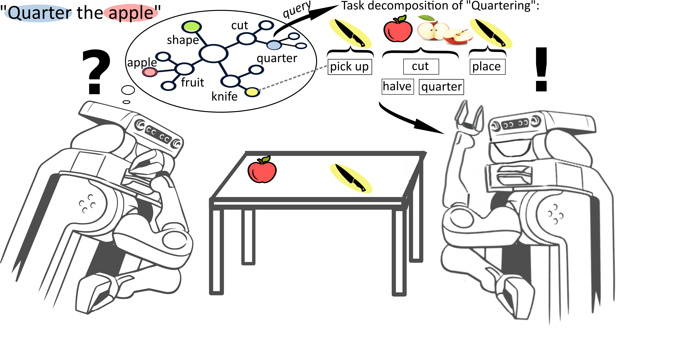
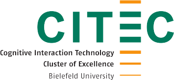

---
# You don't need to edit this file, it's empty on purpose.
# Edit theme's home layout instead if you wanna make some changes
# See: https://jekyllrb.com/docs/themes/#overriding-theme-defaults
layout: page
title: Food Cutting
icon: fa-home
order: 1
---

**ANNOUNCEMENT**
We present our work in a **Tutorial on Contextualizing and Executing Robot Manipulation Plans Using Web Knowledge** at [ESWC24](https://2024.eswc-conferences.org/) and [HHAI24](https://hhai-conference.org/2024/).
More information can be found on the corresponding [Website](https://kr3-workshop.net/).

This project deals with the challenge of enabling robots to learn everyday manipulation tasks in the household domain.
This challenge is important for robots that can perform a wide breadth of manipulation tasks and task variations, that can be performed by various robots using various tools for a variety of purposes.
The focus of this work lies on the task of *Cutting Food*, especially fruits and vegetables:

   

# Disclaimer

The knowledge graph is made available under the [Open Data Commons Attribution License](http://opendatacommons.org/licenses/by/1.0/). It is publicly available [here](https://github.com/Food-Ninja/FoodCutting/blob/main/food_cutting.owl) and on [triply](https://api.krr.triply.cc/datasets/mkumpel/FruitCuttingKG/services/FruitCuttingKG/sparql) for inspection and querying, many thanks to the [knowledge representation and reasoning group](https://krr.cs.vu.nl/) at the Vrije Universiteit Amsterdam.

This work has been created by the [Institute for Artificial Intelligence](https://ai.uni-bremen.de/) at the University of Bremen as well as the [Semantic Computing Group](https://www.uni-bielefeld.de/fakultaeten/technische-fakultaet/arbeitsgruppen/semantic-computing/) at the Cluster of Excellence Cognitive Interaction Technology at Bielefeld University. Please contact [Michaela Kümpel](https://ai.uni-bremen.de/team/michaela_k%C3%BCmpel) (michaela(dot)kuempel(at)uni-bremen(dot)de) or [Jan-Philipp Töberg](https://www.uni-bielefeld.de/fakultaeten/technische-fakultaet/arbeitsgruppen/semantic-computing/team/jan-philipp-toeberg/) (jtoeberg(at)techfak(dot)uni-bielefeld(dot)de) for further information or collaboration.

      
      
      

